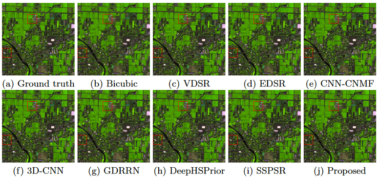

## Hyperspectral Image Super-resolution using pyramid methods

### Intro

This repo contains my master's project on single image hyperspectral image super-resolution.

Model `FPNSR` is an implementation of my IFTC 2019 paper.

Model `SSPSR` is an implementation of the TCI 2020 paper.

Model `IPNSR` is an enhanced version of the original IFTC 2019 model. It uses image-level pyramid instead of feature-level pyramid and achieves better results.

### Results

#### Subjective
**Chikusei dataset, sr factor x4:**

| Methods| MPSNR | MSSIM | CC | ERGAS | SAM | RMSE |
| :----:| :----: | :----: | :----: | :----: | :----: | :----: |
|FPNSR|40.1784|0.9400|0.9549|5.1113|2.3348|0.0116|
|SSPSR|40.3612|0.9413|0.9565|4.9894|2.3527|0.0114|
|IPNSR|40.4876|0.9462|0.9577|4.8866|2.3368|0.0112|

(SSPSR/FPNSR results are from the original paper.)

#### Objective


### Prerequisites

* Python 3.6
* PyTorch >1.1 (if you don't need tensorboard, >0.4 is fine)
* numpy
* cv2
* tqdm
* scipy
* pandas
* skimage

You also need MATLAB to generate your dataset. Please refer to `./data_preparation`.

### Usage

Training:

```
python train.py --data_dir YOUR_DATASET_PATH --dataset Chikusei 
--model IPNSR --sr_factor 4 --gpus 0, 1
```

Testing:

```
python test.py --gpus 0
```
You need to specify `test_data_dir`, `model_name` and `save_model_title` in the global settings of `test.py`.

### Acknowledgement

If use use the above models, please cite:

```
@InProceedings{10.1007/978-981-15-3341-9_5,
author="Sun, He
and Zhong, Zhiwei
and Zhai, Deming
and Liu, Xianming
and Jiang, Junjun",
title="Hyperspectral Image Super-Resolution Using Multi-scale Feature Pyramid Network",
booktitle="Digital TV and Wireless Multimedia Communication",
year="2020",
publisher="Springer Singapore",
address="Singapore",
pages="49--61",
isbn="978-981-15-3341-9"
}
```

```
@article{jiang2020learning,
 author={J. {Jiang} and H. {Sun} and X. {Liu} and J. {Ma}}, 
 journal={IEEE Transactions on Computational Imaging}, 
 title={Learning Spatial-Spectral Prior for Super-Resolution of Hyperspectral Imagery}, 
 year={2020}, 
 volume={6}, 
 number={}, 
 pages={1082-1096},}
```