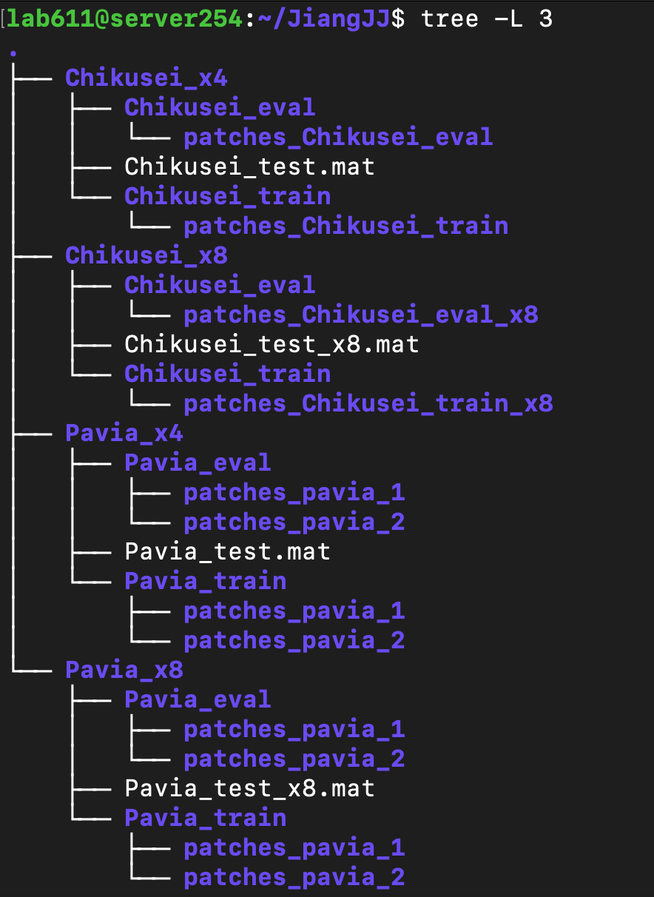

## Data preparation for Chikusei dataset

### About Chikusei dataset

Chikusei dataset contains a single hyperspectral image of size 2517×2335 with 128 channels. The dataset in provided in `.mat` format. We downloaded it from [this link](https://naotoyokoya.com/Download.html).

### Data preparation

After downloading the dataset, you could copy that file to this folder. Then do the following steps:

* Run `crop_and_save.m`
* Run `generate_train_data.m`. It creates your training set.
* Run `generate_test_data.m`. It creates your testset.
* Select some patches randomly from your training set (about 10%) and put them in another folder to create your evaluation set.
We simply use all patches with index > 3000 for evaluation.

You final dataset directory should look like that:



### What does each `.m` file do?

* `crop_and_save.m`: Remove border regions, crop 4 test images and leave the rest for training.
* `generate_train_data.m`: make LR-HR pairs for training set.
* `generate_test_data.m`: make LR-HR test pairs for testset.
* `crop_image.m`: crop patches from a image and downsample it. 

### Acknowledgement

If you use Chikusei dataset, please cite:

```
@techreport{NYokoya2016,
author = {N. Yokoya and A. Iwasaki},
title = {Airborne hyperspectral data over Chikusei},
institution = {Space Application Laboratory, University of Tokyo},
number = {SAL-2016-05-27},
address = {Japan},
month = {May},
year = 2016,
}
```